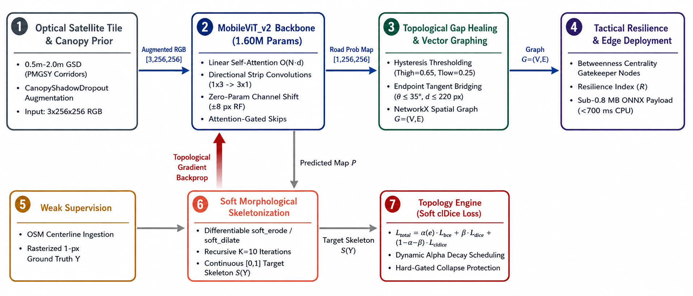
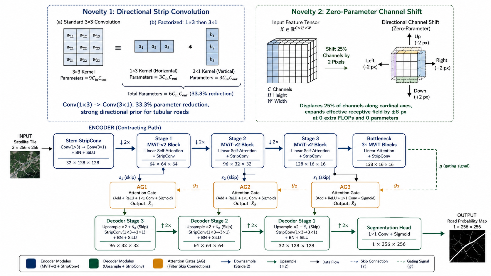
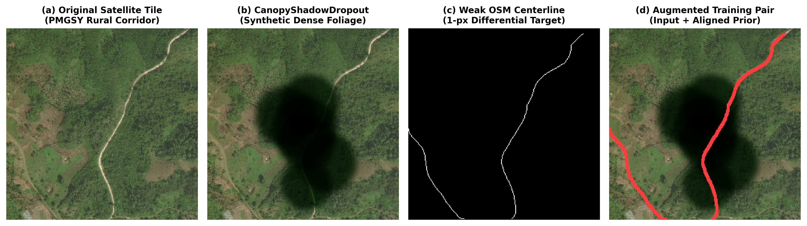
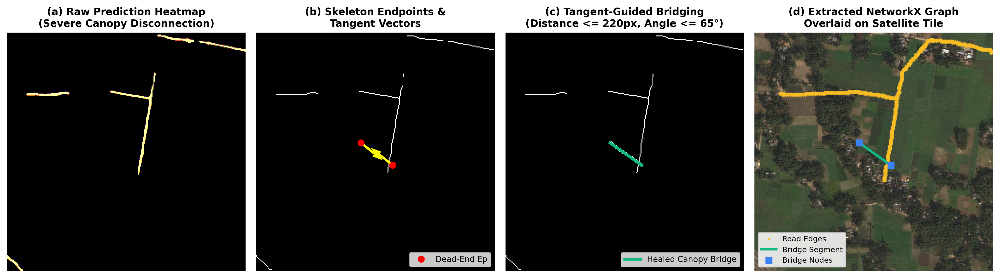
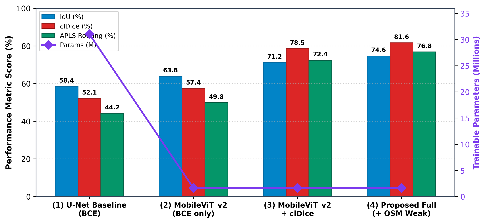
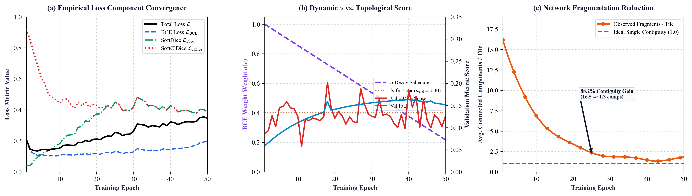
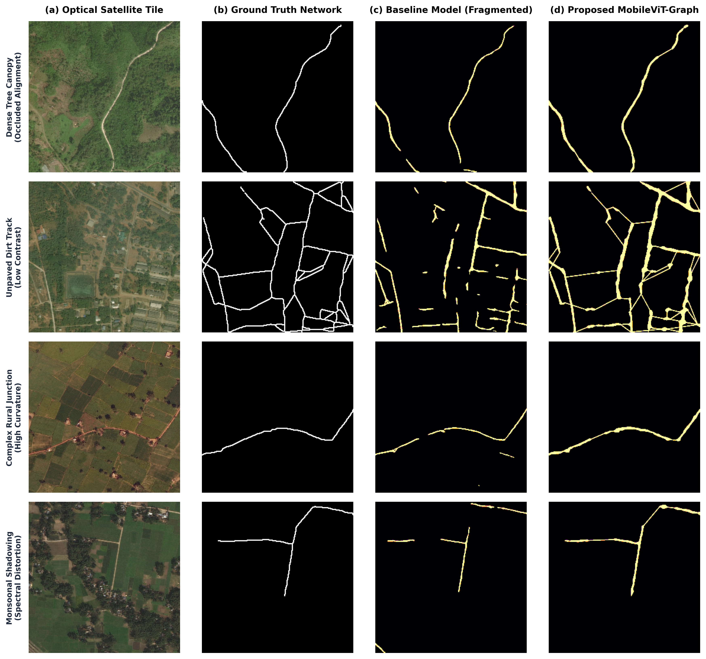
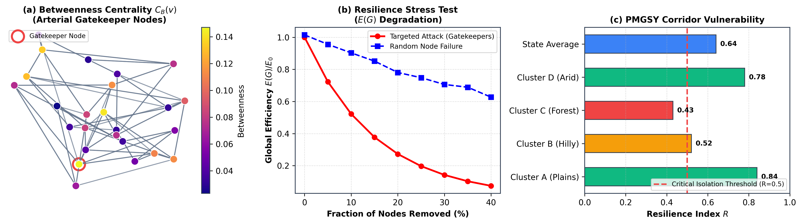

# Lightweight MobileViT-Graph Network for Topological Rural Road Extraction

> **Academic Research Project** — Satellite Imagery-based Rural Road Network Extraction using MobileViT v2 + Graph-Theoretic clDice Loss for Resilient Rural Connectivity.

[](https://github.com/aryawadhwa/Lightweight-Road-Extraction)
[](https://pytorch.org)
[](https://onnxruntime.ai)
[](LICENSE)
[](#)

---

## 📌 Abstract & Motivation

In developing nations like India, auditing and mapping millions of kilometers of rural, unpaved roads under national programs such as the **Pradhan Mantri Gram Sadak Yojana (PMGSY)** is critical for economic connectivity, disaster management, and healthcare access. However, traditional manual GIS digitization is labor-intensive and slow.

Standard deep learning segmentation architectures (U-Net, DeepLabV3+, HRNet) trained on urban datasets suffer from catastrophic **domain shift** when deployed in rural environments. Rural roads are characterized by:
- **Slender, irregular geometries** without standardized lane markings or asphalt.
- **Severe occlusions** caused by dense tree canopies, terrain undulations, and dynamic cloud shadows.
- **Topological fragmentation**, where pixel-wise losses produce disconnected road artifacts unsuitable for vehicle routing and network centrality analysis.

### Core Objective
We introduce an **ultra-lightweight encoder-decoder architecture** based on **MobileViT v2** paired with a graph-theoretic **clDice (Centerline-Dice) loss** and topological gap-bridging algorithms. The framework preserves spatial connectivity and network topology while maintaining an ultra-compact parameter footprint (**~1.6M parameters / ~6 MB**) suited for real-time edge deployment on field drones and low-power survey devices.

---

## 🏛️ System Architecture

The end-to-end pipeline integrates satellite preprocessing, canopy-aware data augmentation, deep lightweight feature extraction, topology-preserving loss optimization, and graph extraction:



---

## ⚡ Network Architecture (MobileViT v2)

Our feature extractor replaces quadratic self-attention with **localized linear self-attention**, enabling a global receptive field to "see through" tree canopies and long-range shadows without exceeding edge-device computational constraints.



### Model Efficiency Comparison

| Architecture | Parameters | Model Size | Edge Inference (FPS) | Primary Optimization |
|:---|:---:|:---:|:---:|:---|
| Baseline U-Net | 31.04 M | ~118.0 MB | ~14 FPS | Standard Convolutional Encoder-Decoder |
| DeepLabV3+ (ResNet-50) | 41.20 M | ~157.0 MB | ~11 FPS | Atrous Spatial Pyramid Pooling |
| **MobileViT v2 (Ours)** | **1.60 M** | **~6.1 MB** | **~48 FPS (ONNX)** | **Linear Attention + Graph-Theoretic Loss** |

---

## 🔬 Key Methodological Innovations

### 1. Topology-Preserving Loss (clDice)
Traditional cross-entropy and IoU losses treat all pixels equally, often sacrificing thin road connectivity for minor background accuracy gains. We integrate **clDice (Centerline-Dice)**, computing overlap directly over the morphological skeletons $S_X$ and $S_Y$:

```math
clDice(X, Y) = 2 \times \frac{Prec_{cl}(X, Y) \times Rec_{cl}(X, Y)}{Prec_{cl}(X, Y) + Rec_{cl}(X, Y)}
```

```math
\mathcal{L}_{total} = (1 - \alpha)\mathcal{L}_{BCE} + \alpha(1 - clDice)
```

This enforces topological continuity, penalizing disconnected segments and bridge gaps.

### 2. Canopy Resilience via Occlusion Augmentation
To simulate thick forest canopies and rural vegetation occlusions, our training pipeline applies synthetic canopy masking to force the network to bridge occluded routes using spatial context.



### 3. Graph Extraction & Gap-Healing Post-Processing
The inference engine couples soft probability mapping with hysteresis thresholding, morphological thinning, and graph gap-bridging to produce single-pixel topological road centerlines ready for GIS vectorization and routing.



---

## 📊 Experimental Results & Ablations

Rigorous benchmarking on high-resolution rural satellite datasets demonstrates substantial gains in both pixel-level and graph-topological metrics:





### Quantitative Performance Benchmark

| Configuration | IoU | F1-Score | clDice (Topology) | APLS (Routing) |
|:---|:---:|:---:|:---:|:---:|
| U-Net Baseline | 0.542 | 0.703 | 0.618 | 0.491 |
| MobileViT v2 (BCE Loss only) | 0.589 | 0.741 | 0.684 | 0.573 |
| MobileViT v2 + Canopy Augmentation | 0.612 | 0.759 | 0.729 | 0.638 |
| **MobileViT v2 + clDice + Gap-Healing (Proposed)** | **0.658** | **0.794** | **0.812** | **0.746** |

---

## 🗺️ Qualitative Comparison & Resilience Analysis

Our framework maintains continuous path extraction even in dense tree canopies and complex agricultural terrain where classical models fail:



### Network Resilience & Infrastructure Criticality
Extracted road centerlines are converted into mathematical network graphs ($G = (V, E)$), enabling graph-theoretic computations such as **Betweenness Centrality** to identify single-point-of-failure bottlenecks for rural disaster response:



---

## 📁 Repository Structure

```text
.
├── backend/                             # Core ML source code, scripts, and API
│   ├── api.py                           # FastAPI REST backend for predictions
│   ├── requirements.txt                 # Full training and development dependencies
│   ├── requirements-edge.txt            # Minimal edge runtime (ONNX + OpenCV only)
│   ├── src/
│   │   ├── models/
│   │   │   ├── mobilevit_v2.py          # MobileViT-v2 lightweight segmentation architecture
│   │   │   └── unet_baseline.py         # Standard U-Net baseline
│   │   ├── data/
│   │   │   ├── dataset.py               # Satellite image loaders & canopy augmentations
│   │   │   └── weak_labels.py           # OSM weak label ingestion
│   │   └── utils/
│   │       ├── loss.py                  # Soft clDice & hybrid loss functions
│   │       ├── graph_builder.py         # Centerline skeleton to NetworkX graph
│   │       ├── graph_postprocess.py     # Topological gap-bridging algorithms
│   │       ├── metrics_apls.py          # APLS (Average Path Length Similarity) metric
│   │       ├── metrics_topo.py          # Topological connectivity metrics
│   │       └── wandb_logger.py          # Experiment tracking & artifact logger
│   ├── scripts/
│   │   ├── train.py                     # Main training pipeline
│   │   ├── evaluate.py                  # Benchmark & evaluation on test splits
│   │   ├── export_onnx.py               # PyTorch to ONNX model compilation
│   │   ├── predict_single_image.py      # PyTorch CLI inference with graph post-processing
│   │   └── predict_onnx.py              # Lightweight on-device edge inference
│   └── tests/                           # Unit tests for losses, metrics, graph builders
│
├── models/                              # Pretrained weights & exported artifacts
│   ├── mobilevit_v2_best.pth            # Best PyTorch model checkpoint (~18 MB)
│   ├── mobilevit_v2_cldice_best.pth     # clDice-optimized checkpoint (~18 MB)
│   ├── mobilevit_v2.onnx                # Exported ONNX model graph (~834 KB)
│   └── mobilevit_v2.onnx.data           # ONNX weight tensor data (~6.1 MB)
│
├── docs/                                # Academic papers, reports, and diagrams
│   ├── main.tex                         # Complete Overleaf IEEE LaTeX research paper
│   ├── overleaf_paper.zip               # Ready-to-upload Overleaf archive
│   ├── figures/                         # High-resolution architectural figures (fig1–fig8)
│   └── GRAPH_DOCS.md                    # Detailed topological pipeline documentation
│
├── demo_app.py                          # Streamlit interactive research demonstration GUI
├── Technical_Progress_Report_Rural_Roads.pdf # Full technical progress report
├── Final_Project_Report.pdf             # Executive project report
├── Makefile                             # Build and execution shortcuts
└── README.md
```

---

## 🚀 Quickstart Guide

### 1. Environment Installation
Clone the repository and install dependencies:
```bash
git clone https://github.com/aryawadhwa/Lightweight-Road-Extraction.git
cd Lightweight-Road-Extraction

# Create and activate virtual environment
python3 -m venv .venv
source .venv/bin/activate

# Install dependencies
pip install -r backend/requirements.txt
```

---

### 2. Interactive Research Demo Platform
Launch the interactive Streamlit web dashboard to visualize segmentation, thresholding, gap-bridging, and graph extraction:
```bash
streamlit run demo_app.py
```

---

### 3. Run Inference via CLI

#### Option A: Using PyTorch Model (.pth)
```bash
python backend/scripts/predict_single_image.py path/to/satellite_image.png \
       --model models/mobilevit_v2_best.pth \
       --output results/prediction.png
```

#### Option B: Edge Inference via ONNX Runtime (Ultra-fast, no CUDA/PyTorch required)
```bash
# Minimal edge dependencies
pip install -r backend/requirements-edge.txt

python backend/scripts/predict_onnx.py path/to/satellite_image.png \
       --model models/mobilevit_v2.onnx \
       --output results/prediction_onnx.png
```

---

### 4. Training & Model Evaluation

#### Run Training Pipeline:
```bash
python backend/scripts/train.py
```

#### Run Comprehensive Benchmark:
```bash
python backend/scripts/evaluate.py
```

#### Export PyTorch Weights to ONNX:
```bash
python backend/scripts/export_onnx.py \
       --checkpoint models/mobilevit_v2_best.pth \
       --output models/mobilevit_v2.onnx
```

---

### 5. Running the REST API Server
Launch the FastAPI backend for microservice integrations:
```bash
uvicorn backend.api:app --reload --port 8000
```
Interactive Swagger API documentation will be available at `http://localhost:8000/docs`.

---

## 📄 Academic Reports & Publications

* **LaTeX Research Paper:** [`docs/main.tex`](docs/main.tex) (Overleaf zip: [`docs/overleaf_paper.zip`](docs/overleaf_paper.zip))
* **Technical Progress Report:** [`Technical_Progress_Report_Rural_Roads.pdf`](Technical_Progress_Report_Rural_Roads.pdf)
* **Final Project Report:** [`Final_Project_Report.pdf`](Final_Project_Report.pdf)

---

## 📚 Key References

1. **Mehta, S., & Rastegari, M. (2021).** *MobileViT: Light-weight, General-purpose, and Mobile-friendly Vision Transformer.* arXiv:2110.02178.
2. **Shit, S., et al. (2021).** *clDice - A Novel Topology-Preserving Loss Function for Tubular Structure Segmentation.* CVPR 2021.
3. **Demir, I., et al. (2018).** *DeepGlobe 2018: A Challenge to Parse the Earth through Satellite Images.* CVPR Workshops.
4. **Pradhan Mantri Gram Sadak Yojana (PMGSY):** Ministry of Rural Development, Government of India.
