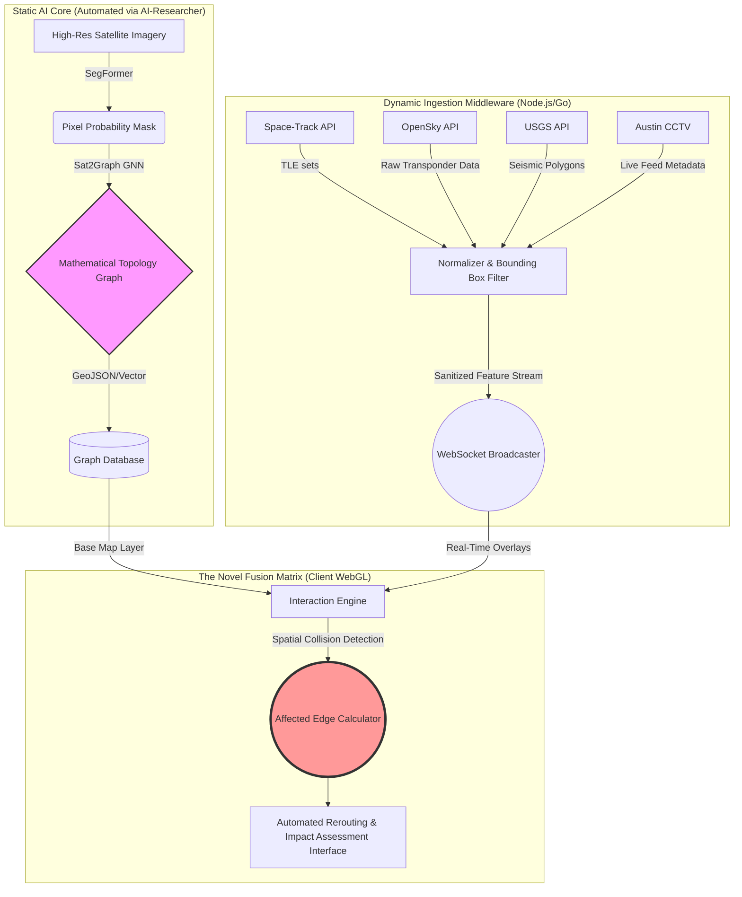
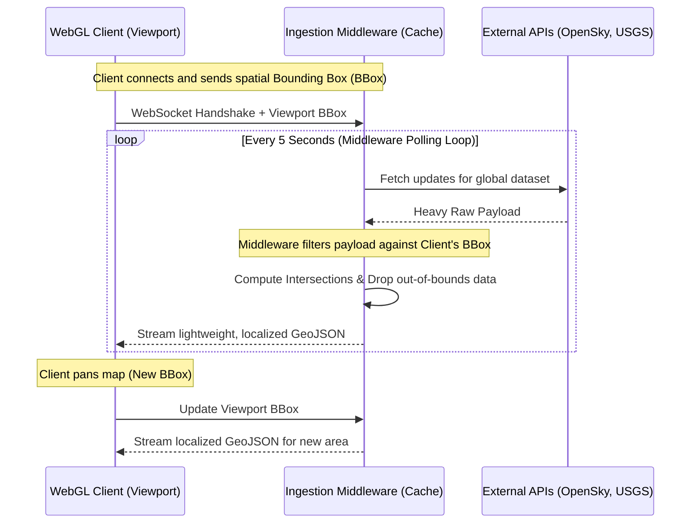
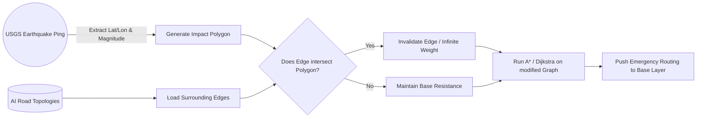

# System Architecture Diagrams: GeoScribe

These diagrams formally visualize the data pipelines and the novel intersection matrix required for the SOTA Paper and Patent application.

## 1. High-Level Spatial Computing Engine

This diagram illustrates the separation between the static AI generation and the real-time dynamic data ingestion, converging at the fusion matrix.

## 2. Ingestion & Polling Strategy (Avoiding API Limits)

This sequence diagram details how the middleware protects the API rate limits while serving high-frequency data to the clients.

## 3. The "Inventive Step" Spatial Collision

This diagram focuses specifically on the patentable aspect: how an external event dynamically alters the autonomously generated road network.

